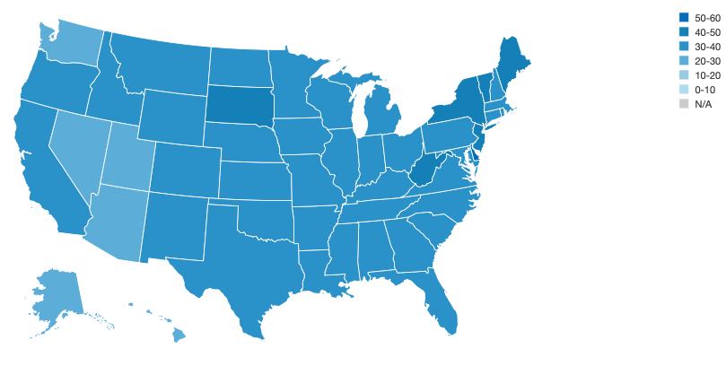
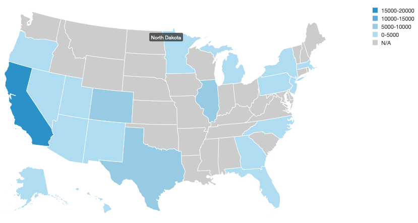
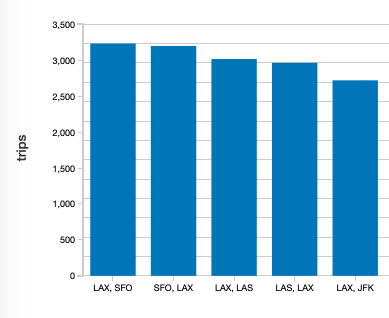
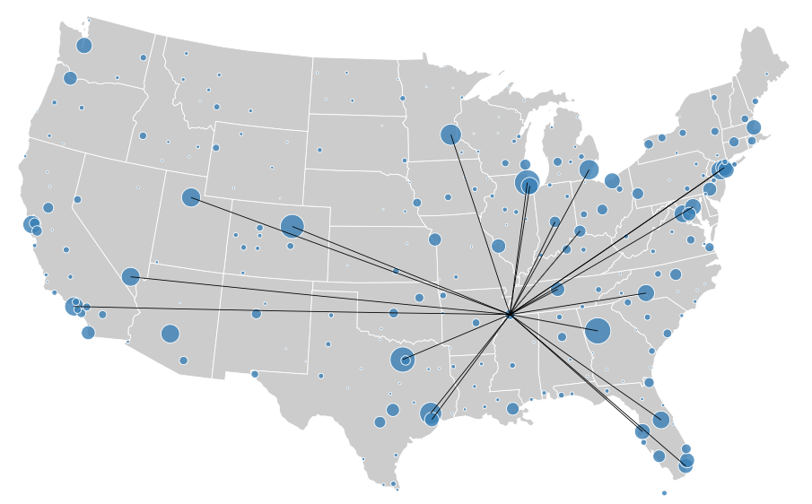

# Graphframes Examples

> IMPORTANTE: certifique-se que está usando a versão 8 do Java. Não pode ser inferior nem superior. O seu Spark também deve ser a versão 2.4. Não pode ser inferior nem superior


## Using Scala

```bash
spark-shell --packages graphframes:graphframes:0.7.0-spark2.4-s_2.11
```

### Tutorial

Devemos importar alguns pacotes adicionais

```scala
import scala.reflect.runtime.universe.TypeTag

import org.apache.spark.SparkContext
import org.apache.spark.sql.SQLContext
import org.apache.spark.sql.DataFrame
import org.apache.spark.sql.Dataset
import org.apache.spark.sql.Row
import org.apache.spark.sql.functions.{col, lit, randn, udf, desc}

import org.graphframes.GraphFrame
import org.graphframes.GraphFrame._

```


A `spark-shell` disponibiliza um objeto `org.apache.spark.sql.SparkSession` na `val spark`, então podemos ubter uma `org.apache.spark.SparkContext` assim:

```scala
/**
 * Returns an empty GraphFrame of the given ID type.
 */
def empty[T: TypeTag]: GraphFrame = {
  import spark.implicits._
  val vertices = Seq.empty[Tuple1[T]].toDF(ID)
  val edges = Seq.empty[(T, T)].toDF(SRC, DST)
  GraphFrame(vertices, edges)
}

/**
 * Returns a list containing the most connected persons.
 */
def getMostConnected(g: GraphFrame, topN: Int): Dataset[Row] = {
    val gInDegrees = g.inDegrees
    g.vertices.join(gInDegrees, "id").orderBy(desc("inDegree")).limit(topN)
}

/**
 * Graph of friends in a social network.
 */
def friends: GraphFrame = {
  // Vertex DataFrame 
  val v = spark.createDataFrame(List(
    ("a", "Alice", 34),
    ("b", "Bob", 36),
    ("c", "Charlie", 30),
    ("d", "David", 29),
    ("e", "Esther", 32),
    ("f", "Fanny", 36),
    ("g", "Gabby", 60)
  )).toDF("id", "name", "age")
  // Edge DataFrame
  val e = spark.createDataFrame(List(
    ("a", "b", "friend"),
    ("b", "c", "follow"),
    ("c", "b", "follow"),
    ("f", "c", "follow"),
    ("e", "f", "follow"),
    ("e", "d", "friend"),
    ("d", "a", "friend"),
    ("a", "e", "friend")
  )).toDF("src", "dst", "relationship")

  // Create a GraphFrame
  GraphFrame(v, e)
}

val g = friends

// Lista as 5 pessoas mais seguidas na rede
val mostConnected = getMostConnected(g, 5)
mostConnected.show()

// Pessoas que seguem o Bob
val connectedToBob = g.find("(a)-[e]->(b)").
  filter("b.id = 'b'").
  select("a.id", "a.name")
connectedToBob.show()  

// Pessoas que talvez a Alice conheça 
val peopleYouMayKnow = g.find("(a)-[e]->(b); (b)-[e2]->(c); !(a)-[]->(c)").
  filter("a.id = 'a'").select("c.id", "c.name")
peopleYouMayKnow.show()

// Este motif mostra os pares de pessoas que segue uma a outra e que são maiores de idade.
g.find("(a)-[e]->(b); (b)-[e2]->(a)").filter("b.age > 18").show()

```

```text
+----------------+--------------+----------------+--------------+
|               a|             e|               b|            e2|
+----------------+--------------+----------------+--------------+
|    [b, Bob, 36]|[b, c, follow]|[c, Charlie, 30]|[c, b, follow]|
|[c, Charlie, 30]|[c, b, follow]|    [b, Bob, 36]|[b, c, follow]|
+----------------+--------------+----------------+--------------+
```

```scala
// Display the vertex and edge DataFrames
g.vertices.show()
g.edges.show()

// Get a DataFrame with columns "id" and "inDeg" (in-degree)
val vertexInDegrees: DataFrame = g.inDegrees
// and show them.
vertexInDegrees.show()

// Find the youngest user's age in the graph.
// This queries the vertex DataFrame.
g.vertices.groupBy().min("age").show()

// Count the number of "follows" in the graph.
// This queries the edge DataFrame.
val numFollows = g.edges.filter("relationship = 'follow'").count()

// Search for pairs of vertices with edges in both directions between them.
val motifs: DataFrame = g.find("(a)-[e]->(b); (b)-[e2]->(a)")
motifs.show()
motifs.filter("b.age > 18").show()

import org.apache.spark.sql.Column
import org.apache.spark.sql.functions.{col, when}

// Find chains of 4 vertices.
val chain4 = g.find("(a)-[ab]->(b); (b)-[bc]->(c); (c)-[cd]->(d)")

// Query on sequence, with state (cnt)
//  (a) Define method for updating state given the next element of the motif.
def sumFriends(cnt: Column, relationship: Column): Column = {
  when(relationship === "friend", cnt + 1).otherwise(cnt)
}

//  (b) Use sequence operation to apply method to sequence of elements in motif.
//      In this case, the elements are the 3 edges.
val condition = { Seq("ab", "bc", "cd")
  .foldLeft(lit(0))((cnt, e) => sumFriends(cnt, col(e)("relationship"))) }

//  (c) Apply filter to DataFrame.
val chainWith2Friends2 = chain4.where(condition >= 2)
chainWith2Friends2.show()

// Select subgraph of users older than 30, and relationships of type "friend".
// Drop isolated vertices (users) which are not contained in any edges (relationships).
val g1 = g.filterVertices("age > 30").filterEdges("relationship = 'friend'").dropIsolatedVertices()
g1.edges.show()

// Select subgraph based on edges "e" of type "follow"
// pointing from a younger user "a" to an older user "b".
val paths = { g.find("(a)-[e]->(b)")
  .filter("e.relationship = 'follow'")
  .filter("a.age < b.age") }
// "paths" contains vertex info. Extract the edges.
val e2 = paths.select("e.src", "e.dst", "e.relationship")
// The user may simplify this call:
//  val e2 = paths.select("e.*")

// Construct the subgraph
val g2 = GraphFrame(g.vertices, e2)
g2.edges.show()

// Busca em largura 
// Breadth-first search (BFS) finds the shortest path(s) from one vertex 
// (or a set of vertices) to another vertex (or a set of vertices). 
// The beginning and end vertices are specified as Spark DataFrame 
// expressions.
// Search from "Esther" for users of age < 40.
val paths = g.bfs.fromExpr("name = 'Esther'").toExpr("age < 40 and name != 'Esther'").run()
paths.show()

// Componentes conectados
// Computes the connected component membership of each vertex and returns a graph 
// with each vertex assigned a component ID.
sc.setCheckpointDir(".")
val result = g.connectedComponents.run()
result.select("id", "component").orderBy("component").show()

// Strongly connected components
// Compute the strongly connected component (SCC) of each vertex and return 
// a graph with each vertex assigned to the SCC containing that vertex.
val result = g.stronglyConnectedComponents.maxIter(10).run()
result.select("id", "component").orderBy("component").show()

// Label Propagation Algorithm (LPA)
// Run static Label Propagation Algorithm for detecting communities in networks.
// Each node in the network is initially assigned to its own community. 
// At every superstep, nodes send their community affiliation to all neighbors 
// and update their state to the mode community affiliation of incoming messages.
// LPA is a standard community detection algorithm for graphs. It is very 
// inexpensive computationally, although (1) convergence is not guaranteed 
// and (2) one can end up with trivial solutions (all nodes are identified 
// into a single community).
val result = g.labelPropagation.maxIter(5).run()
result.select("id", "label").show()

// PageRank
// There are two implementations of PageRank.
// The first one uses the org.apache.spark.graphx.graph interface with aggregateMessages 
// and runs PageRank for a fixed number of iterations. This can be executed by setting maxIter.
// The second implementation uses the org.apache.spark.graphx.Pregel interface and 
// runs PageRank until convergence and this can be run by setting tol.
// Both implementations support non-personalized and personalized PageRank, where 
// setting a sourceId personalizes the results for that vertex.

// Run PageRank until convergence to tolerance "tol".
val results = g.pageRank.resetProbability(0.15).tol(0.01).run()

// Display resulting pageranks and final edge weights
// Note that the displayed pagerank may be truncated, e.g., missing the E notation.
// In Spark 1.5+, you can use show(truncate=false) to avoid truncation.
results.vertices.select("id", "pagerank").show()
results.edges.select("src", "dst", "weight").show()

// Run PageRank for a fixed number of iterations.
val results2 = g.pageRank.resetProbability(0.15).maxIter(10).run()
results2.edges.show
// Run PageRank personalized for vertex "a"
val results3 = g.pageRank.resetProbability(0.15).maxIter(10).sourceId("a").run()
results3.edges.show

// Run PageRank personalized for vertex ["a", "b", "c", "d"] in parallel
val results3 = g.parallelPersonalizedPageRank.resetProbability(0.15).maxIter(10).sourceIds(Array("a", "b", "c", "d")).run()
results3.edges.show

// Since GraphFrames are built around DataFrames, they automatically support 
// saving and loading to and from the same set of datasources. 
g.vertices.write.parquet("vertices")
g.edges.write.parquet("edges")

```

## Using Python

```bash
pyspark --packages graphframes:graphframes:0.7.0-spark2.4-s_2.11
```

### Tutorial

```python
# Create a Vertex DataFrame with unique ID column "id"
v = spark.createDataFrame([
  ("a", "Alice", 34),
  ("b", "Bob", 36),
  ("c", "Charlie", 30),
], ["id", "name", "age"])

# Create an Edge DataFrame with "src" and "dst" columns
e = sqlContext.createDataFrame([
  ("a", "b", "friend"),
  ("b", "c", "follow"),
  ("c", "b", "follow"),
], ["src", "dst", "relationship"])
# Create a GraphFrame
from graphframes import *
g = GraphFrame(v, e)

# Query: Get in-degree of each vertex.
g.inDegrees.show()

```


### On-Time Flight Performance with GraphFrames for Apache Spark

```bash
cat DATA/tripVertices.csv 

id,City,State,Country
STL,St. Louis,MO,USA
EKO,Elko,NV,USA
RAP,Rapid City,SD,USA
GRK,Killeen,TX,USA
MSY,New Orleans,LA,USA
LGA,New York,NY,USA
JFK,New York,NY,USA
EWN,New Bern,NC,USA
. . .
```


```bash
DATA/tripEdges.csv 
tripid,delay,src,dst,city_dst,state_dst
1011158,-5,SAN,IAH,Houston,TX
1011516,-8,SAN,IAH,Houston,TX
1010937,16,SAN,IAH,Houston,TX
1010702,1,SAN,IAH,Houston,TX
1010620,3,SAN,IAH,Houston,TX
```

Note: `src` and `dst` from `tripEdges` are `id` on `tripVertices`


```python
# Build `tripGraph` GraphFrame
#  This GraphFrame builds up on the vertices and edges based on our trips (flights)
tripGraph = GraphFrame(tripVertices, tripEdges)
print tripGraph

# Build `tripGraphPrime` GraphFrame
#   This graphframe contains a smaller subset of data to make it easier to display motifs and subgraphs (below)
tripEdgesPrime = departureDelays_geo.select("tripid", "delay", "src", "dst")
tripGraphPrime = GraphFrame(tripVertices, tripEdgesPrime)

# Let's start with a set of simple graph queries to understand flight performance and departure delays
#Determine the number of airports and trips 
print "Airports: %d" % tripGraph.vertices.count()
print "Trips: %d" % tripGraph.edges.count()

# Determining the longest delay in this dataset
longestDelay = tripGraph.edges.groupBy().max("delay")
display(longestDelay)

# Determining number of on-time / early flights vs. delayed flights
print "On-time / Early Flights: %d" % tripGraph.edges.filter("delay <= 0").count()
print "Delayed Flights: %d" % tripGraph.edges.filter("delay > 0").count()

# What flights departing SFO are most likely to have significant delays
# Note, delay can be <= 0 meaning the flight left on time or early

sfoDelay = tripGraph.edges\
  .filter("src = 'SFO' and delay > 0")\
  .groupBy("src", "dst")\
  .avg("delay")\
  .sort(desc("avg(delay)"))

display(sfoDelay)  

# What destinations tend to have delays

# After displaying tripDelays, use Plot Options to set `state_dst` as a Key.
tripDelays = tripGraph.edges.filter("delay > 0")
display(tripDelays)

```



```python
# What destinations tend to have significant delays departing from SEA

# States with the longest cumulative delays (with individual delays > 100 minutes) (origin: Seattle)
display(tripGraph.edges.filter("src = 'SEA' and delay > 100"))

```




```python
# Vertex Degrees
# inDegrees: Incoming connections to the airport
# outDegrees: Outgoing connections from the airport
# degrees: Total connections to and from the airport
# Reviewing the various properties of the property graph to understand the incoming and outgoing connections between airports.
# 
# Degrees
#  The number of degrees - the number of incoming and outgoing connections - for various airports within this sample dataset
display(tripGraph.degrees.sort(desc("degree")).limit(20))

# City / Flight Relationships through Motif Finding
# To more easily understand the complex relationship of city airports and their flights with each other, we can use motifs to find patterns of airports (i.e. vertices) connected by flights (i.e. edges). The result is a DataFrame in which the column names are given by the motif keys.
# What delays might we blame on SFO
# 
# Using tripGraphPrime to more easily display 
#   - The associated edge (ab, bc) relationships 
#   - With the different the city / airports (a, b, c) where SFO is the connecting city (b)
#   - Ensuring that flight ab (i.e. the flight to SFO) occured before flight bc (i.e. flight leaving SFO)
#   - Note, TripID was generated based on time in the format of MMDDHHMM converted to int
#       - Therefore bc.tripid < ab.tripid + 10000 means the second flight (bc) occured within approx a day of the first flight (ab)
# Note: In reality, we would need to be more careful to link trips ab and bc.
motifs = tripGraphPrime.find("(a)-[ab]->(b); (b)-[bc]->(c)")\
  .filter("(b.id = 'SFO') and (ab.delay > 500 or bc.delay > 500) and bc.tripid > ab.tripid and bc.tripid < ab.tripid + 10000")
display(motifs)

# Determining Airport Ranking using PageRank
# There are a large number of flights and connections through these various airports included in this Departure Delay Dataset. Using the pageRank algorithm, Spark iteratively traverses the graph and determines a rough estimate of how important the airport is.
#
# Determining Airport ranking of importance using `pageRank`
ranks = tripGraph.pageRank(resetProbability=0.15, maxIter=5)
display(ranks.vertices.orderBy(ranks.vertices.pagerank.desc()).limit(20))

# Most popular flights (single city hops)
# Using the tripGraph, we can quickly determine what are the most popular single city hop flights
# 
# Determine the most popular flights (single city hops)
import pyspark.sql.functions as func
topTrips = tripGraph \
  .edges \
  .groupBy("src", "dst") \
  .agg(func.count("delay").alias("trips")) 

# Show the top 5 most popular flights (single city hops)
display(topTrips.orderBy(topTrips.trips.desc()).limit(5))

```




```python
# Top Transfer Cities
# Many airports are used as transfer points instead of the final Destination. An easy way to calculate this is by calculating the ratio of inDegree (the number of flights to the airport) / outDegree (the number of flights leaving the airport). Values close to 1 may indicate many transfers, whereas values < 1 indicate many outgoing flights and > 1 indicate many incoming flights. Note, this is a simple calculation that does not take into account of timing or scheduling of flights, just the overall aggregate number within the dataset.
# 
# Calculate the inDeg (flights into the airport) and outDeg (flights leaving the airport)
inDeg = tripGraph.inDegrees
outDeg = tripGraph.outDegrees
​
# Calculate the degreeRatio (inDeg/outDeg)
degreeRatio = inDeg.join(outDeg, inDeg.id == outDeg.id) \
  .drop(outDeg.id) \
  .selectExpr("id", "double(inDegree)/double(outDegree) as degreeRatio") \
  .cache()
​
# Join back to the `airports` DataFrame (instead of registering temp table as above)
nonTransferAirports = degreeRatio.join(airports, degreeRatio.id == airports.IATA) \
  .selectExpr("id", "city", "degreeRatio") \
  .filter("degreeRatio < .9 or degreeRatio > 1.1")
​
# List out the city airports which have abnormal degree ratios.
display(nonTransferAirports)

```


```csv
id,city,degreeRatio
BRW,Barrow,0.28651685393258425
GFK,Grand Forks,1.3333333333333333
FAI,Fairbanks,1.1232686980609419
OME,Nome,0.5084745762711864

```

```python
# Join back to the `airports` DataFrame (instead of registering temp table as above)
transferAirports = degreeRatio.join(airports, degreeRatio.id == airports.IATA) \
  .selectExpr("id", "city", "degreeRatio") \
  .filter("degreeRatio between 0.9 and 1.1")
  
# List out the top 10 transfer city airports
display(transferAirports.orderBy("degreeRatio").limit(10))
```


```python
# Breadth First Search
# Breadth-first search (BFS) is designed to traverse the graph to quickly find the desired vertices (i.e. airports) and edges (i.e flights). Let's try to find the shortest number of connections between cities based on the dataset. Note, these examples do not take into account of time or distance, just hops between cities.
# 
# Example 1: Direct Seattle to San Francisco 
filteredPaths = tripGraph.bfs(
  fromExpr = "id = 'SEA'",
  toExpr = "id = 'SFO'",
  maxPathLength = 1)
display(filteredPaths)

```


```csv
from,e0,to
"{""id"":""SEA"",""City"":""Seattle"",""State"":""WA"",""Country"":""USA""}","{""tripid"":1010710,""delay"":31,""src"":""SEA"",""dst"":""SFO"",""city_dst"":""San Francisco"",""state_dst"":""CA""}","{""id"":""SFO"",""City"":""San Francisco"",""State"":""CA"",""Country"":""USA""}"
"{""id"":""SEA"",""City"":""Seattle"",""State"":""WA"",""Country"":""USA""}","{""tripid"":1012125,""delay"":-4,""src"":""SEA"",""dst"":""SFO"",""city_dst"":""San Francisco"",""state_dst"":""CA""}","{""id"":""SFO"",""City"":""San Francisco"",""State"":""CA"",""Country"":""USA""}"
"{""id"":""SEA"",""City"":""Seattle"",""State"":""WA"",""Country"":""USA""}","{""tripid"":1011840,""delay"":-5,""src"":""SEA"",""dst"":""SFO"",""city_dst"":""San Francisco"",""state_dst"":""CA""}","{""id"":""SFO"",""City"":""San Francisco"",""State"":""CA"",""Country"":""USA""}"
"{""id"":""SEA"",""City"":""Seattle"",""State"":""WA"",""Country"":""USA""}","{""tripid"":1010610,""delay"":-4,""src"":""SEA"",""dst"":""SFO"",""city_dst"":""San Francisco"",""state_dst"":""CA""}","{""id"":""SFO"",""City"":""San Francisco"",""State"":""CA"",""Country"":""USA""}"
"{""id"":""SEA"",""City"":""Seattle"",""State"":""WA"",""Country"":""USA""}","{""tripid"":1011230,""delay"":-2,""src"":""SEA"",""dst"":""SFO"",""city_dst"":""San Francisco"",""state_dst"":""CA""}","{""id"":""SFO"",""City"":""San Francisco"",""State"":""CA"",""Country"":""USA""}"
"{""id"":""SEA"",""City"":""Seattle"",""State"":""WA"",""Country"":""USA""}","{""tripid"":1010955,""delay"":-6,""src"":""SEA"",""dst"":""SFO"",""city_dst"":""San Francisco"",""state_dst"":""CA""}","{""id"":""SFO"",""City"":""San Francisco"",""State"":""CA"",""Country"":""USA""}"
"{""id"":""SEA"",""City"":""Seattle"",""State"":""WA"",""Country"":""USA""}","{""tripid"":1011100,""delay"":2,""src"":""SEA"",""dst"":""SFO"",""city_dst"":""San Francisco"",""state_dst"":""CA""}","{""id"":""SFO"",""City"":""San Francisco"",""State"":""CA"",""Country"":""USA""}"
"{""id"":""SEA"",""City"":""Seattle"",""State"":""WA"",""Country"":""USA""}","{""tripid"":1011405,""delay"":0,""src"":""SEA"",""dst"":""SFO"",""city_dst"":""San Francisco"",""state_dst"":""CA""}","{""id"":""SFO"",""City"":""San Francisco"",""State"":""CA"",""Country"":""USA""}"
"{""id"":""SEA"",""City"":""Seattle"",""State"":""WA"",""Country"":""USA""}","{""tripid"":1020710,""delay"":-1,""src"":""SEA"",""dst"":""SFO"",""city_dst"":""San Francisco"",""state_dst"":""CA""}","{""id"":""SFO"",""City"":""San Francisco"",""State"":""CA"",""Country"":""USA""}"
"{""id"":""SEA"",""City"":""Seattle"",""State"":""WA"",""Country"":""USA""}","{""tripid"":1022125,""delay"":-4,""src"":""SEA"",""dst"":""SFO"",""city_dst"":""San Francisco"",""state_dst"":""CA""}","{""id"":""SFO"",""City"":""San Francisco"",""State"":""CA"",""Country"":""USA""}"
"{""id"":""SEA"",""City"":""Seattle"",""State"":""WA"",""Country"":""USA""}","{""tripid"":1021840,""delay"":-5,""src"":""SEA"",""dst"":""SFO"",""city_dst"":""San Francisco"",""state_dst"":""CA""}","{""id"":""SFO"",""City"":""San Francisco"",""State"":""CA"",""Country"":""USA""}"
. . .
```


```python
# As you can see, there are a number of direct flights between Seattle and San Francisco.
# But there are no direct flights between San Francisco and Buffalo.
# But there are flights from San Francisco to Buffalo with Minneapolis as the transfer point.

# Example 2a: Direct San Francisco and Buffalo
filteredPaths = tripGraph.bfs(
  fromExpr = "id = 'SFO'",
  toExpr = "id = 'BUF'",
  maxPathLength = 1)
display(filteredPaths)
```

```python
# Example 2b: Flying from San Francisco to Buffalo with transfer point
filteredPaths = tripGraph.bfs(
  fromExpr = "id = 'SFO'",
  toExpr = "id = 'BUF'",
  maxPathLength = 2)
display(filteredPaths)

```


```csv
from,e0,v1,e1,to
"{""id"":""SFO"",""City"":""San Francisco"",""State"":""CA"",""Country"":""USA""}","{""tripid"":1010630,""delay"":-3,""src"":""SFO"",""dst"":""MSP"",""city_dst"":""Minneapolis"",""state_dst"":""MN""}","{""id"":""MSP"",""City"":""Minneapolis"",""State"":""MN"",""Country"":""USA""}","{""tripid"":2091325,""delay"":-5,""src"":""MSP"",""dst"":""BUF"",""city_dst"":""Buffalo"",""state_dst"":""NY""}","{""id"":""BUF"",""City"":""Buffalo"",""State"":""NY"",""Country"":""USA""}"
"{""id"":""SFO"",""City"":""San Francisco"",""State"":""CA"",""Country"":""USA""}","{""tripid"":1010630,""delay"":-3,""src"":""SFO"",""dst"":""MSP"",""city_dst"":""Minneapolis"",""state_dst"":""MN""}","{""id"":""MSP"",""City"":""Minneapolis"",""State"":""MN"",""Country"":""USA""}","{""tripid"":1051520,""delay"":37,""src"":""MSP"",""dst"":""BUF"",""city_dst"":""Buffalo"",""state_dst"":""NY""}","{""id"":""BUF"",""City"":""Buffalo"",""State"":""NY"",""Country"":""USA""}"
"{""id"":""SFO"",""City"":""San Francisco"",""State"":""CA"",""Country"":""USA""}","{""tripid"":1010830,""delay"":52,""src"":""SFO"",""dst"":""MSP"",""city_dst"":""Minneapolis"",""state_dst"":""MN""}","{""id"":""MSP"",""City"":""Minneapolis"",""State"":""MN"",""Country"":""USA""}","{""tripid"":2091325,""delay"":-5,""src"":""MSP"",""dst"":""BUF"",""city_dst"":""Buffalo"",""state_dst"":""NY""}","{""id"":""BUF"",""City"":""Buffalo"",""State"":""NY"",""Country"":""USA""}"
"{""id"":""SFO"",""City"":""San Francisco"",""State"":""CA"",""Country"":""USA""}","{""tripid"":1010830,""delay"":52,""src"":""SFO"",""dst"":""MSP"",""city_dst"":""Minneapolis"",""state_dst"":""MN""}","{""id"":""MSP"",""City"":""Minneapolis"",""State"":""MN"",""Country"":""USA""}","{""tripid"":1051520,""delay"":37,""src"":""MSP"",""dst"":""BUF"",""city_dst"":""Buffalo"",""state_dst"":""NY""}","{""id"":""BUF"",""City"":""Buffalo"",""State"":""NY"",""Country"":""USA""}"
"{""id"":""SFO"",""City"":""San Francisco"",""State"":""CA"",""Country"":""USA""}","{""tripid"":1011300,""delay"":-6,""src"":""SFO"",""dst"":""MSP"",""city_dst"":""Minneapolis"",""state_dst"":""MN""}","{""id"":""MSP"",""City"":""Minneapolis"",""State"":""MN"",""Country"":""USA""}","{""tripid"":2091325,""delay"":-5,""src"":""MSP"",""dst"":""BUF"",""city_dst"":""Buffalo"",""state_dst"":""NY""}","{""id"":""BUF"",""City"":""Buffalo"",""State"":""NY"",""Country"":""USA""}"
"{""id"":""SFO"",""City"":""San Francisco"",""State"":""CA"",""Country"":""USA""}","{""tripid"":1011300,""delay"":-6,""src"":""SFO"",""dst"":""MSP"",""city_dst"":""Minneapolis"",""state_dst"":""MN""}","{""id"":""MSP"",""City"":""Minneapolis"",""State"":""MN"",""Country"":""USA""}","{""tripid"":1051520,""delay"":37,""src"":""MSP"",""dst"":""BUF"",""city_dst"":""Buffalo"",""state_dst"":""NY""}","{""id"":""BUF"",""City"":""Buffalo"",""State"":""NY"",""Country"":""USA""}"
"{""id"":""SFO"",""City"":""San Francisco"",""State"":""CA"",""Country"":""USA""}","{""tripid"":1020630,""delay"":-7,""src"":""SFO"",""dst"":""MSP"",""city_dst"":""Minneapolis"",""state_dst"":""MN""}","{""id"":""MSP"",""City"":""Minneapolis"",""State"":""MN"",""Country"":""USA""}","{""tripid"":2091325,""delay"":-5,""src"":""MSP"",""dst"":""BUF"",""city_dst"":""Buffalo"",""state_dst"":""NY""}","{""id"":""BUF"",""City"":""Buffalo"",""State"":""NY"",""Country"":""USA""}"
. . .

```

### Visualizing Flights Using D3

To get a powerful visualization of the flight paths and connections in this dataset, we can leverage the Airports D3 visualization within our Databricks notebook.  By connecting our GraphFrames, DataFrames, and D3 visualizations, we can visualize the scope of all of the flight connections as noted below for all on-time or early departing flights within this dataset.  The blue circles represent the vertices (i.e. airports) where the size of the circle represents the number of edges (i.e. flights) in and out of those airports.  The black lines are the edges themselves (i.e. flights) and their respective connections to the other vertices (i.e. airports).  Note for any edges that go offscreen, they are representing vertices (i.e. airports) in the states of Hawaii and Alaska.


```scala
// Loading the D3 Visualization
// Using the airports D3 visualization to visualize airports and flight paths
// 
// %scala package d3a // We use a package object so that we can define top level cl ...
//
// %scala d3a.graphs.help()
//
// Visualize On-time and Early Arrivals
// Produces a force-directed graph given a collection of edges of the following form:
case class Edge(src: String, dest: String, count: Long)

// Usage:
// %scala
import d3._
graphs.force(
  height = 500,
  width = 500,
  clicks: Dataset[Edge])

// %scala
// On-time and Early Arrivals
import d3a._
graphs.force(
  height = 800,
  width = 1200,
  clicks = sql("""select src, dst as dest, count(1) as count 
  from departureDelays_geo 
  where delay <= 0 group by src, dst
  """).as[Edge])

```



mOvie view: 

```python

```

